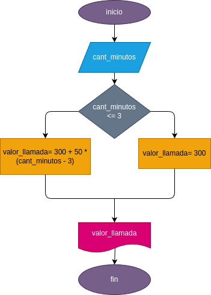

# condicionales_1
condicionales 1
## Costo de una llamada telefonica

ingresar el tiempo de duracion de una llamada telefonica y determinar la cantidad a pagar, de acuerdo con lo siguiente:
- Toda llamada que dure 3 minutos o menos tiene un costo de 300 pesos.
- Cada minuto adicional cuesta 50 pesos.
# diseño

